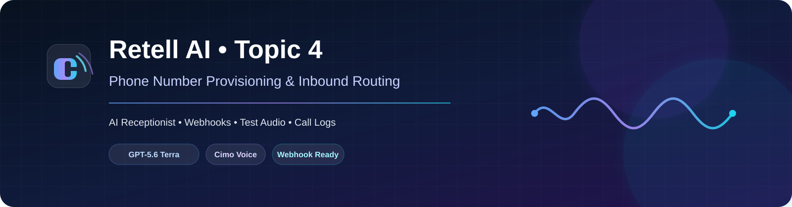

# ☎️ Retell AI — Topic 4: Phone Number Provisioning & Inbound Routing

<b>AI Receptionist • Webhooks • Test Audio • Call Logs</b>

<a href="https://www.loom.com/share/47d3c033fcdd469f906556ded41de79a">🎥 Loom Demo</a> • <a href="./Retell_AI_Topic_4_LMS_Assessment_Documentation.pdf">📄 LMS PDF</a> • <a href="./screenshots/">🖼️ Evidence</a>

---

## ✨ Project Overview

This repository documents my Retell AI Topic 4 assessment focused on Phone Number Provisioning & Inbound Routing.

The project uses `Trainee_Sarah_Receptionist`, a single-prompt voice agent configured as an AI receptionist with GPT-5.6 Terra, Cimo voice, English (US), agent-first greeting behavior, and an agent-level call-event webhook.

> **Evidence-first:** web-call/Test Audio evidence is kept separate from real PSTN phone evidence. The current account requires identity verification before a phone number can be purchased, so the blocked telephony steps are documented rather than represented as completed.

## 🤖 Agent Configuration

| Setting | Configuration |
|---|---|
| Agent | `Trainee_Sarah_Receptionist` |
| Agent type | Single-Prompt Voice Agent |
| Model | GPT-5.6 Terra |
| Voice | Cimo |
| Language | English (US) |
| Start speaker | AI / Agent speaks first |
| Tool | Built-in `end_call` |
| Knowledge base | None |
| Use case | AI receptionist / inbound customer support |

## 🔗 Webhook

The agent contains an agent-level call-event webhook pointing to a Webhook.site test endpoint. The configured voice-agent event set includes `call_started`, `call_ended`, and `call_analyzed`.

## 📊 Assessment Evidence

| Assessment area | Status | Evidence |
|---|---:|---|
| Voice agent configured | ✅ | Agent screenshot |
| Receptionist prompt | ✅ | Prompt screenshot |
| Test Audio / web-call validation | ✅ | Test Audio + Call History |
| Agent-level webhook configured | ✅ | Webhook settings |
| Webhook events received | 🟡 | Verify actual payload before claiming |
| Transcript / recording | 🟡 | Capture from actual test session |
| Phone number provisioned | 🚫 Blocked | Identity Verification screen |
| Number → agent binding | 🚫 Blocked | Requires phone number |
| Multiple-number routing | 🚫 Blocked | Requires 2+ numbers |
| Real inbound PSTN call | 🚫 Blocked | Requires phone number |
| Caller phone metadata | 🚫 Blocked | Requires real phone call |

## 🎥 Loom Walkthrough

**[Open the Loom Demo](https://www.loom.com/share/47d3c033fcdd469f906556ded41de79a)**

Recommended order:

1. Show `Trainee_Sarah_Receptionist` and its prompt.
2. Run Test Audio and demonstrate the receptionist conversation.
3. Show webhook configuration and actual event payloads, if received.
4. Show Retell Call History and transcript.
5. Show the Phone Numbers → Identity Verification Required screen.

## 📄 Assessment Documentation

**[Open the LMS Assessment PDF](./Retell_AI_Topic_4_LMS_Assessment_Documentation.pdf)**

## 🧪 What Test Audio Proves

Test Audio can demonstrate the agent voice, greeting, prompt behavior, conversation flow, and web-call transcript/recording. It does not prove PSTN routing, caller phone metadata, phone-number provisioning, number binding, or multi-number routing.

## 🚧 Telephony Limitation

The Phone Numbers page currently shows no provisioned phone number. Selecting **Buy New Number** leads to an **Identity Verification Required** flow. The real inbound PSTN requirements are therefore documented as blocked instead of being presented as completed.

## 📁 Repository Contents

- `README.md` — project overview and evidence map
- `Retell_AI_Topic_4_LMS_Assessment_Documentation.pdf` — assessment documentation
- `screenshots/` — organized evidence area
- `Loom_Demo_Link.md` — Loom reference
- `assets/` — visual project assets

## 🧠 Skills Demonstrated

**Retell AI** · Voice Agent Configuration · Prompt Engineering · AI Receptionist Design · Webhook Configuration · Web-Call Testing · Conversation Logs · Transcript Review · Assessment Documentation

---

<b>Built for the Orion LMS / Tayana Academy Retell AI learning track.</b> Clear evidence • Reproducible configuration • Honest validation

