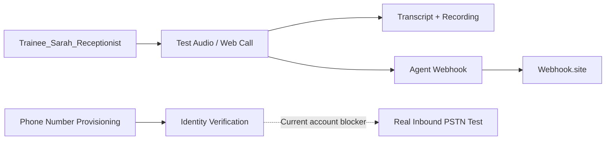

# ☎️ Retell AI — Topic 4
## Phone Number Provisioning & Inbound Routing

<p align="center">
  
</p>

<p align="center">
  <b>AI Receptionist</b> • <b>Webhooks</b> • <b>Test Audio</b> • <b>Call Logs</b>
</p>

<p align="center">
  <a href="https://www.loom.com/share/47d3c033fcdd469f906556ded41de79a">🎥 <b>Loom Demo</b></a>
  &nbsp; • &nbsp;
  <a href="./Retell_AI_Topic_4_LMS_Assessment_Documentation.pdf">📄 <b>LMS PDF</b></a>
  &nbsp; • &nbsp;
  <a href="./screenshots/README.md">🖼️ <b>Evidence Guide</b></a>
</p>

<p align="center">
  
  
  
  
</p>

---

## ✨ Project Overview

This repository documents my **Retell AI Topic 4 LMS assessment** focused on **Phone Number Provisioning & Inbound Routing**.

The project uses **`Trainee_Sarah_Receptionist`**, a single-prompt voice agent configured as an AI receptionist with GPT-5.6 Terra, Cimo voice, English (US), agent-first greeting behavior, and an agent-level call-event webhook.

> **Evidence-first:** Test Audio / web-call evidence is kept separate from real PSTN evidence. The current Retell account requires identity verification before purchasing a phone number, so the blocked telephony requirements are documented rather than represented as completed.

---

## 🧭 Assessment Flow



---

## 🤖 Agent Configuration

| Setting | Configuration |
|---|---|
| **Agent** | `Trainee_Sarah_Receptionist` |
| **Agent type** | Single-Prompt Voice Agent |
| **Model** | GPT-5.6 Terra |
| **Voice** | Cimo |
| **Language** | English (US) |
| **Start speaker** | AI / Agent speaks first |
| **Tool** | Built-in `end_call` |
| **Knowledge base** | None |
| **Use case** | AI receptionist / inbound customer support |

### 🎯 Receptionist behavior

- Greets the caller warmly.
- Asks the reason for the call.
- Collects caller name and callback number when needed.
- Answers simple business/service questions.
- Avoids inventing information.
- Confirms captured details before ending.
- Keeps responses short, clear, and polite.

---

## 🔗 Webhook Configuration

The agent contains an **agent-level Webhook.site endpoint**.

Configured event types:

- `call_started`
- `call_ended`
- `call_analyzed`

**Evidence rule:** configuration is shown separately from delivery. A webhook event is marked as received only when its actual JSON payload is visible.

---

## 📊 Assessment Evidence Matrix

| Assessment area | Status | Evidence |
|---|:---:|---|
| Voice agent configured | ✅ | Agent configuration screenshot |
| Receptionist prompt | ✅ | Agent prompt screenshot |
| Test Audio / web-call validation | ✅ | Test Audio + Call History |
| Agent-level webhook configured | ✅ | Webhook settings screenshot |
| Webhook events received | 🟡 | Actual payload must be visible |
| Transcript / recording | ✅ | Retell Call History screenshot |
| Phone number provisioned | 🚫 Blocked | Identity Verification screenshot |
| Number → agent binding | 🚫 Blocked | Requires provisioned number |
| Multiple-number routing | 🚫 Blocked | Requires 2+ numbers |
| Real inbound PSTN call | 🚫 Blocked | Requires provisioned number |
| Caller phone metadata | 🚫 Blocked | Requires real phone call |

---

## 🖼️ Evidence Gallery

### 01 — Phone Number Provisioning Blocker


**Evidence:** Retell displays **Identity Verification Required** before a phone number can be purchased.

### 02 — Phone Numbers


**Evidence:** No phone numbers are currently provisioned; available options are Buy New Number and SIP trunking.

### 03 — Agent + Test Audio


**Evidence:** `Trainee_Sarah_Receptionist`, model, Cimo voice, prompt, and Test Audio are visible.

### 04 — Call History + Transcript


**Evidence:** Retell web-call history includes duration, cost, recording, analysis, and transcript.

### 05 — Webhook Settings


**Evidence:** Agent-level webhook URL and webhook event setup are visible.

### 06 — Agent Configuration


**Evidence:** Agent prompt and configuration panels are visible.

### 07 — Retell Home / Getting Started


---

## 🎥 Loom Demonstration

### [▶️ Watch the Loom Demo](https://www.loom.com/share/47d3c033fcdd469f906556ded41de79a)

Recommended walkthrough:

1. Open `Trainee_Sarah_Receptionist`.
2. Show the receptionist prompt and configuration.
3. Run Test Audio and demonstrate the conversation.
4. Show webhook configuration and actual event payloads, if received.
5. Show Retell Call History and transcript.
6. Show the Phone Numbers → **Identity Verification Required** screen.

---

## 📄 Assessment Documentation

### [📥 Open the LMS Assessment Documentation PDF](./Retell_AI_Topic_4_LMS_Assessment_Documentation.pdf)

The PDF contains the assessment scope, configuration summary, evidence checklist, screenshot plan, and telephony limitation.

---

## 🧪 What Test Audio Proves

Test Audio demonstrates:

- Voice configuration
- Greeting behavior
- Prompt behavior
- Conversation flow
- Web-call transcript / recording
- Agent-level call-event workflow when events are actually received

It does **not** prove:

- PSTN/mobile inbound routing
- Caller phone metadata
- Phone-number provisioning
- Number-to-agent binding
- Multi-number routing
- Real telephony/SIP behavior

---

## 🚧 Telephony Limitation

The current Retell Phone Numbers page shows **no provisioned phone number**. Selecting **Buy New Number** opens an **Identity Verification Required** flow.

The real inbound PSTN requirements therefore remain documented as blocked rather than being presented as completed.

---

## 📁 Repository Structure

```text
retell-ai-topic-4-phone-number-inbound-routing/
├── README.md
├── Retell_AI_Topic_4_LMS_Assessment_Documentation.pdf
├── Loom_Demo_Link.md
├── assets/
│   └── retell-topic4-banner.svg
├── screenshots/
│   └── README.md
└── Retell evidence screenshots
```

---

## 🧠 Skills Demonstrated

**Retell AI** · Voice Agent Configuration · Prompt Engineering · AI Receptionist Design · Webhook Configuration · Web-Call Testing · Call Logs · Transcript Review · Assessment Documentation

---

<p align="center">
  <b>Built for the Orion LMS / Tayana Academy Retell AI learning track.</b><br>
  <sub>Clear evidence • Reproducible configuration • Honest validation</sub>
</p>
